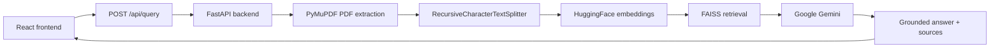

# AI Document Assistant

AI Document Assistant is a full-stack RAG-based application for uploading PDF documents, extracting their text, retrieving the most relevant content semantically, and generating grounded answers with source-aware document/page references.

## Features
- PDF upload
- PDF text extraction
- Page-level metadata preservation
- Recursive text chunking
- Semantic embeddings with Hugging Face
- FAISS vector retrieval
- Gemini-grounded answer generation
- Source-aware answers with document/page references
- React frontend
- FastAPI backend
- Markdown answer rendering in the frontend
- Responsive UI

## Architecture



## How RAG works in this project
This project uses a simple retrieval-augmented generation flow:

- Retrieval: the uploaded PDF is split into chunks, embeddings are generated, and the most relevant chunks are retrieved for the user question.
- Augmentation: the retrieved chunks are passed into the generation step as document context.
- Generation: Gemini uses that contextual information to answer the question while staying grounded in the uploaded document.

## Detailed pipeline
1. User uploads a PDF from the React frontend.
2. The FastAPI backend receives the PDF and validates the file.
3. PyMuPDF extracts text with page metadata, preserving the source filename and page number.
4. Recursive chunking splits the extracted text into overlapping chunks.
5. HuggingFace embeddings are generated for the chunks and for the incoming query.
6. FAISS performs semantic retrieval using the query embedding and returns the top-k relevant chunks.
7. Gemini receives the question plus the retrieved chunks and generates a grounded answer.
8. The frontend displays the answer and the source document/page references.

## Tech stack
### Frontend
- React.js
- Vite
- JavaScript
- HTML/CSS
- react-markdown

### Backend
- Python
- FastAPI
- Uvicorn

### AI / ML
- Hugging Face embeddings
- Sentence Transformers
- all-MiniLM-L6-v2
- Google Gemini via google-genai

### Vector search
- FAISS

### PDF processing
- PyMuPDF
- LangChain Text Splitters

## Project structure

```text
AI Document Assistant/
├── .gitignore
├── README.md
├── backend/
│   ├── .env.example
│   ├── requirements.txt
│   ├── app/
│   │   ├── __init__.py
│   │   ├── main.py
│   │   └── services/
│   │       ├── chunking_service.py
│   │       ├── embedding_service.py
│   │       ├── gemini_service.py
│   │       ├── pdf_service.py
│   │       └── vector_store.py
├── frontend/
│   ├── package.json
│   ├── package-lock.json
│   ├── index.html
│   ├── src/
│   │   ├── App.jsx
│   │   ├── App.css
│   │   ├── index.css
│   │   └── main.jsx
│   ├── vite.config.js
│   └── .gitignore
```

### Key files
- `backend/app/main.py`: FastAPI application and API routes.
- `backend/app/services/pdf_service.py`: PDF text extraction and page metadata handling.
- `backend/app/services/chunking_service.py`: recursive chunking logic.
- `backend/app/services/embedding_service.py`: Hugging Face embedding generation.
- `backend/app/services/vector_store.py`: FAISS retrieval layer.
- `backend/app/services/gemini_service.py`: Gemini prompt construction and answer generation.
- `frontend/src/App.jsx`: React UI and form handling.
- `frontend/src/App.css`: styling for the frontend UI.
- `backend/.env.example`: example environment variable file.

## Setup requirements
- Python 3.11
- Node.js
- npm

## Backend setup
From the project root:

```powershell
# Activate the virtual environment
.\.venv\Scripts\Activate.ps1

# Enter the backend folder
cd backend

# Install backend dependencies
pip install -r requirements.txt

# Create backend/.env from the example file
Copy-Item .env.example .env
```

Then configure the environment variable in `backend/.env`:

```env
GEMINI_API_KEY=your_gemini_api_key_here
GEMINI_MODEL=gemini-3.6-flash
```

Run the backend with Uvicorn:

```powershell
cd backend
uvicorn app.main:app --reload --host 127.0.0.1 --port 8000
```

## Frontend setup
From the project root:

```powershell
cd frontend
npm install
npm run dev
```

The frontend will run locally with Vite, typically on `http://localhost:5173`.

## Environment variables
### `GEMINI_API_KEY`
This is required for Gemini answer generation. It should be placed in `backend/.env`.

### `GEMINI_MODEL`
Optional model selection override. The current project configuration uses `gemini-3.6-flash`.

> `backend/.env` should never be committed to a public repository. The tracked placeholder file is `backend/.env.example`.

## Usage
1. Open the React frontend in the browser.
2. Select a PDF file.
3. Enter a question about the document.
4. Click `Ask Question`.
5. View the grounded answer and the related source filename/page references.

## API
### `POST /api/query`
This endpoint accepts:
- `file`: the uploaded PDF file
- `question`: the question as a form field

It returns:
- `question`
- `answer`
- `sources`

The current backend response includes `source_filename`, `page_number`, `preview`, and `score` in each source entry. The current frontend UI displays the source filename and page number in the Sources section.

## Grounding behavior
The Gemini prompt in this project instructs the model to answer only from the retrieved document context and to avoid inventing information that is not supported by the uploaded PDF.

## Future improvements
The following items are not currently implemented in this project and are listed as possible future enhancements only:
- persistent vector storage
- multi-document collections
- authentication
- conversation history
- reranking
- streaming responses
- cloud deployment

## License
This project is intended for educational and portfolio purposes.
